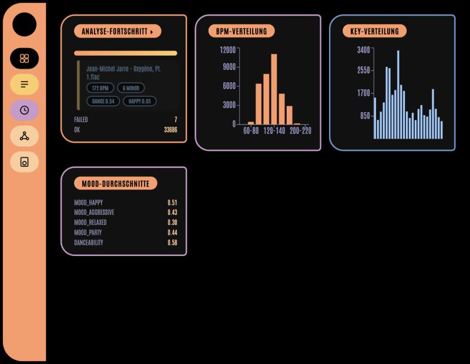
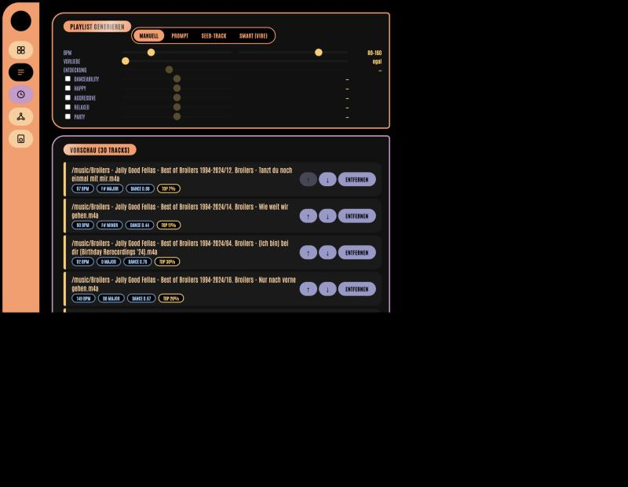
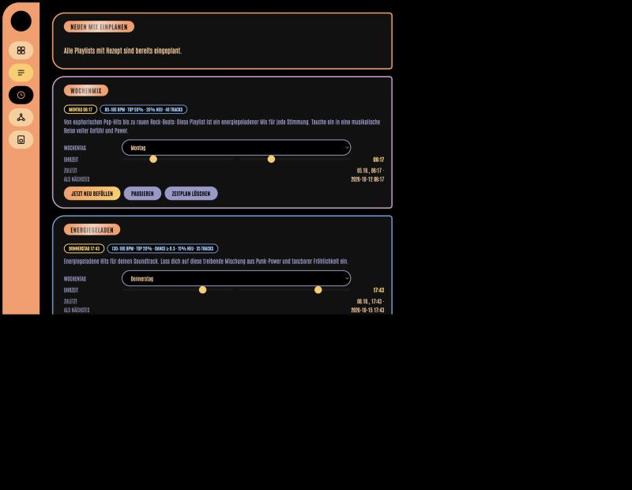
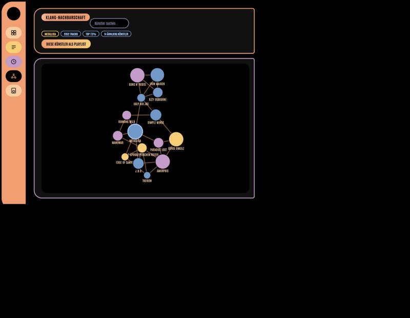
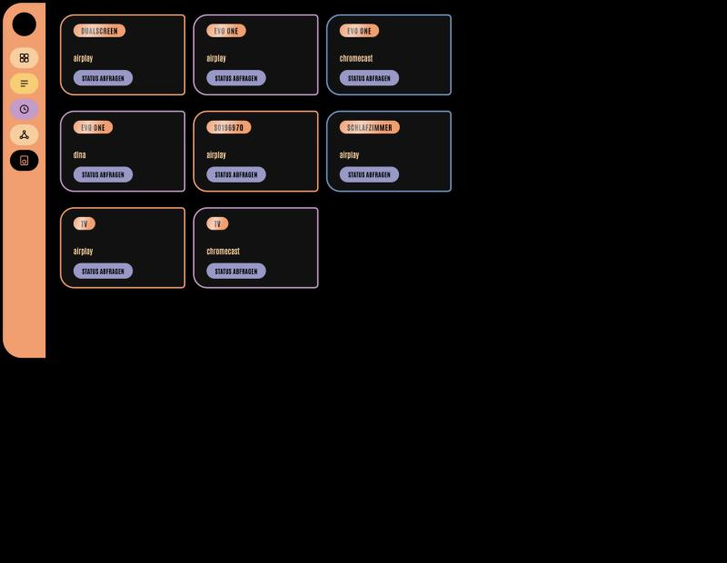

# CrateMind2

Analysiert eine lokale Musikbibliothek mit Essentia und baut daraus Playlists —
nach Klang, nach Geschmack oder beides gemischt. Läuft im Heimnetz neben einem
[VuIO](https://github.com/)-Medienserver und spielt auf DLNA-, AirPlay- und
Chromecast-Geräten ab.



## Was es tut

Ein Hintergrunddienst scannt die Musikordner und berechnet pro Track BPM,
Tonart, fünf Stimmungswerte (happy, aggressive, relaxed, party, danceability)
und ein 200-dimensionales Klang-Embedding. Die Weboberfläche nutzt diese Daten,
um Playlists zusammenzustellen, sie an VuIO zu übergeben und auf einem
Abspielgerät zu starten.

Dazu kommt ein Geschmacksmodell: aus einem Apple-Music-Export importierte
Abspielzahlen, eigene mitgezählte Wiedergaben und manuelle Bewertungen ergeben
pro Track ein Perzentil, das in die Auswahl einfließt.

## Einrichtung

Voraussetzungen: Docker, ein laufender VuIO-Server, die Musik als Dateien im
Dateisystem.

```bash
git clone <repo> && cd CrateMind2
docker compose up -d --build
```

Die Oberfläche läuft danach auf Port **8008**. Der erste Scan dauert je nach
Bibliotheksgröße Stunden — der Fortschritt steht im Dashboard.

### Konfiguration

Die Pfade in `docker-compose.yml` anpassen, vor allem den Musikordner:

```yaml
volumes:
  - /Volumes/Platte/Musik:/music:ro
```

| Variable | Standard | Bedeutung |
|---|---|---|
| `MUSIC_DIR` | `/music` | Musikordner im Container |
| `DB_PATH` | `/data/library.db` | SQLite-Datenbank |
| `SCAN_INTERVAL_SECONDS` | `1800` | Abstand zwischen Scans |
| `VUIO_BASE_URL` | — | VuIO-Server |
| `VUIO_MUSIC_DIR` | = `MUSIC_DIR` | Musikordner, wie **VuIO** ihn sieht |
| `OMLX_BASE_URL` | — | lokales LLM (OpenAI-kompatibel) |
| `TYPESAFE_API_KEY` | — | nur für den Smart-Modus |
| `TZ` | `Europe/Berlin` | Zeitzone für die Zeitpläne |

`VUIO_MUSIC_DIR` ist der häufigste Stolperstein: Beide Dienste indizieren
dieselben Dateien, mounten sie aber oft unter verschiedenen Wurzeln. Stimmt die
Angabe nicht, findet CrateMind die Tracks in VuIO nicht wieder.

Das lokale LLM und der Smart-Modus sind optional. Fällt eines aus, funktioniert
alles andere weiter.

## Playlists bauen



Vier Modi:

**Manuell** — Schieberegler für BPM, Stimmungen und Vorliebe. Kostenlos und
ohne LLM, die Vorschau aktualisiert sich beim Schieben.

**Prompt** — Freitext wie *„energiegeladenes Workout, nur Lieblingstracks"*.
Das lokale Modell übersetzt das in Schwellenwerte; die Auswahl selbst bleibt
deterministisch.

**Seed-Track** — ein Track als Ausgangspunkt, der Rest nach Klangähnlichkeit.
Der Regler *Klang ↔ Geschmack* mischt bei, wie sehr Vorlieben mitreden.

**Smart (Vibe)** — eine Stimmungsbeschreibung, die ein externes Modell über
eine Vorauswahl von 150 Kandidaten sortiert. Der einzige Modus, der Kosten
verursacht.

Zwei Regler gelten modusübergreifend:

- **Vorliebe** filtert nach Perzentil („Top 10%"). Achtung: Zwei Drittel der
  Bibliothek haben keinen Geschmacks-Score — sobald der Regler greift, fallen
  die komplett raus.
- **Entdeckung** gibt deshalb einen Teil der Plätze an genau diese Tracks
  zurück, zufällig gezogen und gleichmäßig eingewoben.

Jede Playlist bekommt höchstens 5 Titel pro Künstler und keine doppelten
Aufnahmen. Vor dem Speichern lassen sich Name und Beschreibung vom lokalen
Modell vorschlagen oder von Hand eintragen.

## Automatische Mixe



Eine Playlist merkt sich das Rezept, aus dem sie entstanden ist, und kann
wöchentlich daraus neu befüllt werden — gleiche Playlist-ID, neue Tracks, neue
Beschreibung. Wochentag und Uhrzeit sind hier einstellbar, dazu Pausieren und
sofortiges Neubefüllen.

Weil die Entdeckungsplätze bei jedem Lauf neu gezogen werden, enthält ein
wöchentlicher Mix jedes Mal anderes unbekanntes Material.

## Klang-Graph



Zeigt einen Künstler mit seinen klanglich nächsten Nachbarn. Knotengröße ist
die Trackzahl, Farbe das Geschmacks-Perzentil (grau = keine Daten). Ein Klick
springt weiter zur Nachbarschaft des angeklickten Künstlers.

Die Kanten bedeuten *klingt ähnlich* — sie stammen aus den Essentia-Embeddings,
nicht aus Metadaten. Mit *Diese Künstler als Playlist* wandert die sichtbare
Auswahl in den Playlists-Tab.

## Abspielen



Zeigt die von VuIO gefundenen Geräte. Eine angelegte Playlist lässt sich direkt
auf eines davon casten. Die Statusleiste unten zeigt den laufenden Titel.

Wiedergaben werden mitgezählt: länger als 30 Sekunden gilt als gespielt,
kürzer als Skip. Das fließt in den Geschmacks-Score ein — und erfasst vor allem
die Musik, die der Apple-Export nie gesehen hat.

## Geschmacksdaten importieren

Optional, verbessert aber die Auswahl deutlich. Aus einem Apple-Media-Services-
Export:

```bash
python3 scripts/import_preferences.py \
  --library-json "Apple Music Library Tracks.json" \
  --db data/library.db \
  --history-csv "Apple Music - Play History Daily Tracks.csv"
```

Ohne `--history-csv` zählt ein Abspielvorgang von 2012 so viel wie einer von
letzter Woche. Mit ihr verfallen alte Wiedergaben (Halbwertszeit zwei Jahre,
über `--half-life-years` einstellbar), sodass der Score dem aktuellen Geschmack
folgt.

Die Zuordnung läuft über die Dateipfade. Wie gut das klappt, verrät vorab:

```bash
python3 scripts/match_probe.py \
  --library-json "Apple Music Library Tracks.json" --db data/library.db
```

## Tests

```bash
cd webapp/backend && for t in test_*.py; do python3 "$t"; done
python3 scripts/test_import_preferences.py
```

Keine Frameworks, jede Datei ist direkt ausführbar.

## Architektur

Zwei Container auf einer gemeinsamen SQLite-Datenbank:

- **analysis** — scannt und analysiert, schreibt `tracks` und `features`.
  Läuft unter `linux/amd64`, weil es für `essentia-tensorflow` kein
  arm64-Paket gibt.
- **webapp** — FastAPI plus React, liest die Analysedaten und besitzt
  Bewertungen, Abspielzahlen, Rezepte und Zeitpläne.

Die Webapp hält Tracks und Künstlergraph im Speicher und lädt sie alle zwei
Minuten neu, wenn der Analysedienst etwas hinzugefügt hat.

Die Oberfläche ist im LCARS-Stil gehalten — schwarz mit orangefarbenen
Pillenformen, aus Spaß an der Sache.
